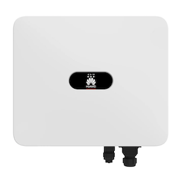
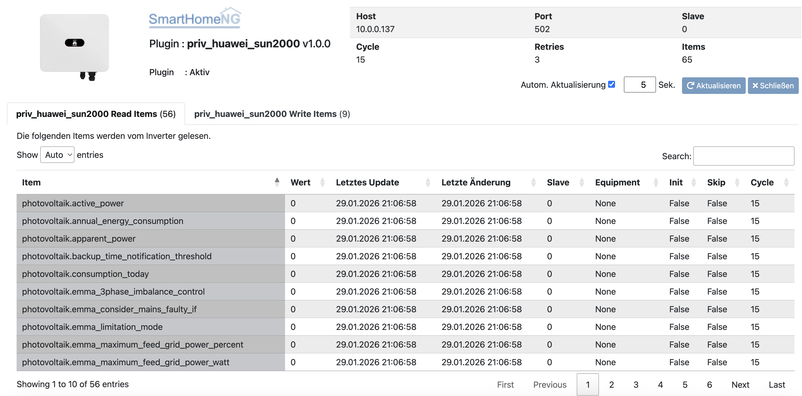

.. index:: Plugins; huawei_sun2000
.. index:: huawei_sun2000

==============
huawei_sun2000
==============

Stellt eine Verbindung zu SUN2000 PV-Invertern von Huawei her und
ermöglicht das Lesen und Schreiben von Registern.

Anforderungen
=============

Notwendige Software
-------------------

* `huawei-solar Pythonmodul <https://pypi.org/project/huawei-solar/>`_

Unterstützte Geräte
-------------------

Huawei SUN2000 Inverter via

* serielle Schnittstelle
* Netzwerk

Informationen zur Verbindung mit den Geräten sind hier zu finden:
`Verbindungsherstellung <https://github.com/wlcrs/huawei_solar/wiki/Connecting-to-the-inverter>`_

Konfiguration
=============

Die Plugin Parameter und die Informationen zur Item-spezifischen Konfiguration des Plugins sind
unter :doc:`/plugins_doc/config/huawei_sun2000` beschrieben.

Es empfiehlt sich, die structs aus dem Plugin zu nutzen.

.. code-block:: yaml

    # items/my.yaml
    photovoltaik:
        poll:
          type: bool
          sun2000_runpoll: True
          autotimer: 1 = 0
        struct:
          - huawei_sun2000.emma
          - huawei_sun2000.emma_built_in_energy_sensor

Folgende structs werden bereitgestellt:

* inverter
* sdongle
* meter
* emma_storage
* emma
* emma_built_in_energy_sensor
* emma_external_energy_sensor
* emma_external_meter
* storage
* storage_unit1
* storage_unit_1_battery_pack_1
* storage_unit_1_battery_pack_2
* storage_unit_1_battery_pack_3
* storage_unit2
* storage_unit_2_battery_pack_1
* storage_unit_2_battery_pack_2
* storage_unit_2_battery_pack_3

Web Interface
=============

Das Plugin Webinterface kann aus dem Admin Interface aufgerufen werden. Dazu auf der Seite Plugins in der entsprechenden
Zeile das Icon in der Spalte **Web Interface** anklicken.

Darunter gibt es einen Tab für zu lesende und beschreibbare Items mit den entsprechend relevanten Informationen.

